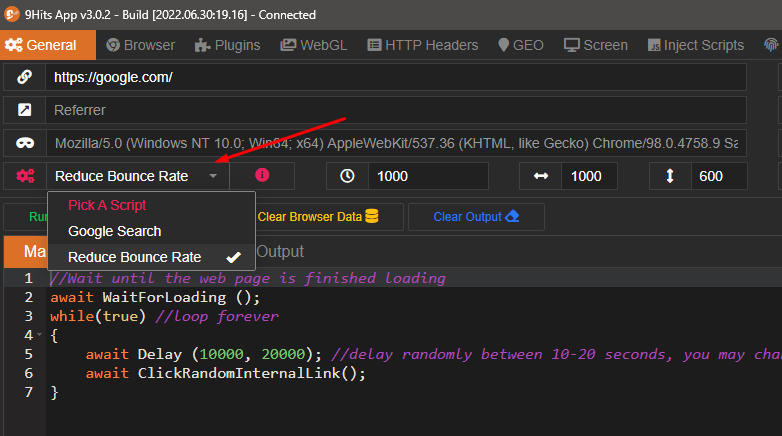

# About
This repo contains pre-built scripts, any contributions are welcome <3

# How to use
From [the macro editor](https://docs.9hits.com/macros/overview/#writing-your-script), you can just select an available script, change its configuaration if needed, and run.




# How to contribute
Create your script file in the `scripts` folder, add your script information to list.json file then make a pull request. For example
```
{
    "author": "9Hits",
    "file": "google-search.js",
    "title": "Google Search",
    "description": "Script for doing google search"
}
```
